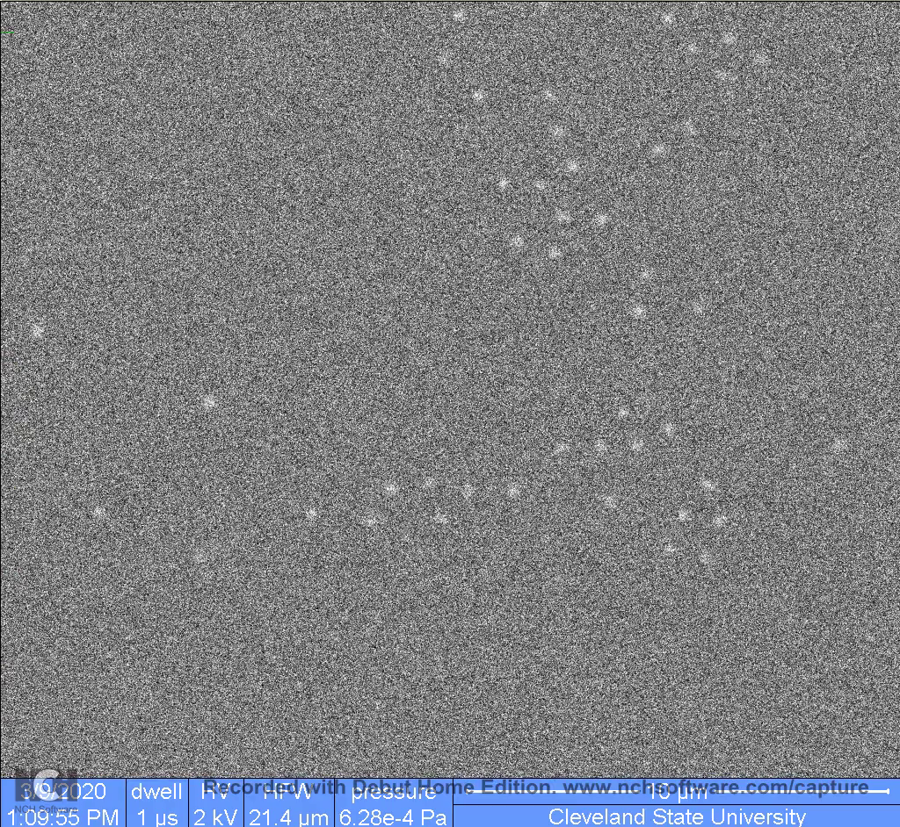
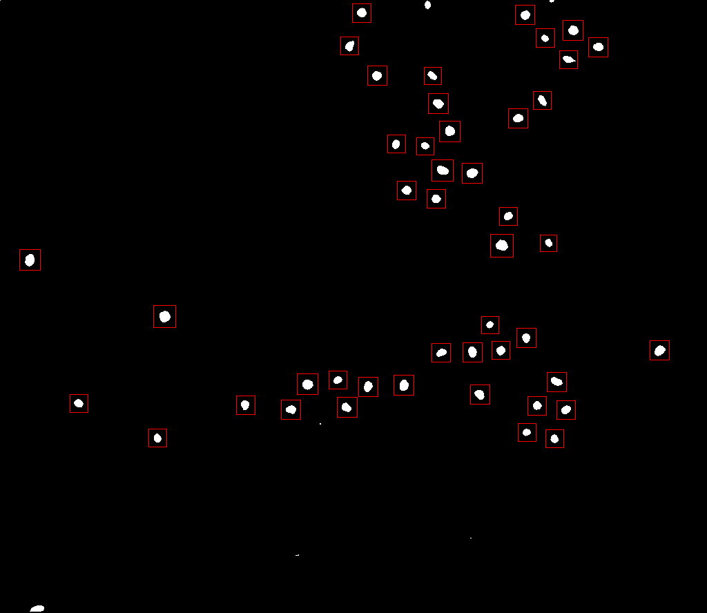
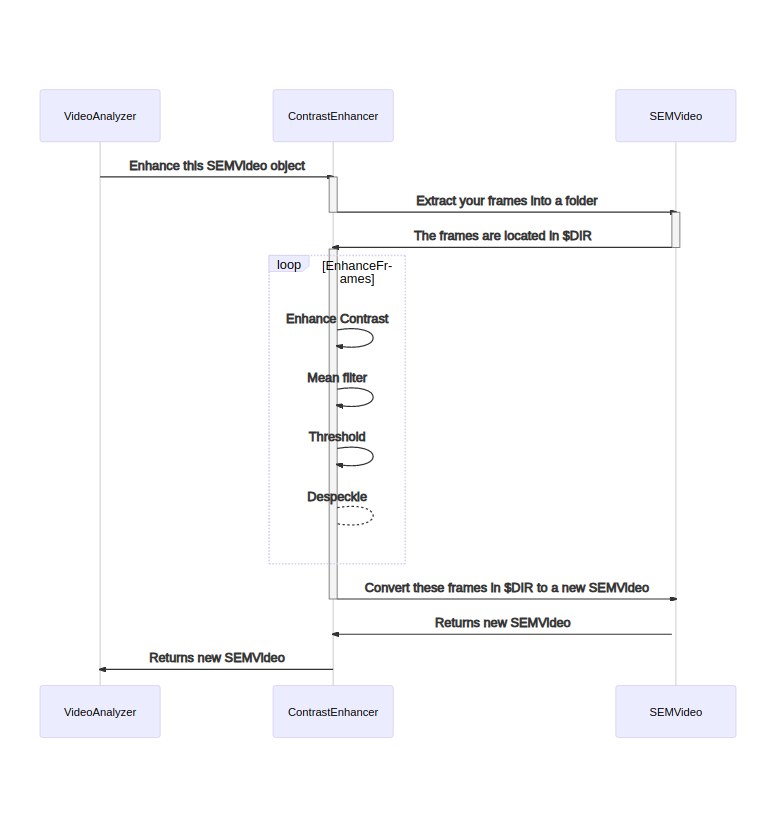
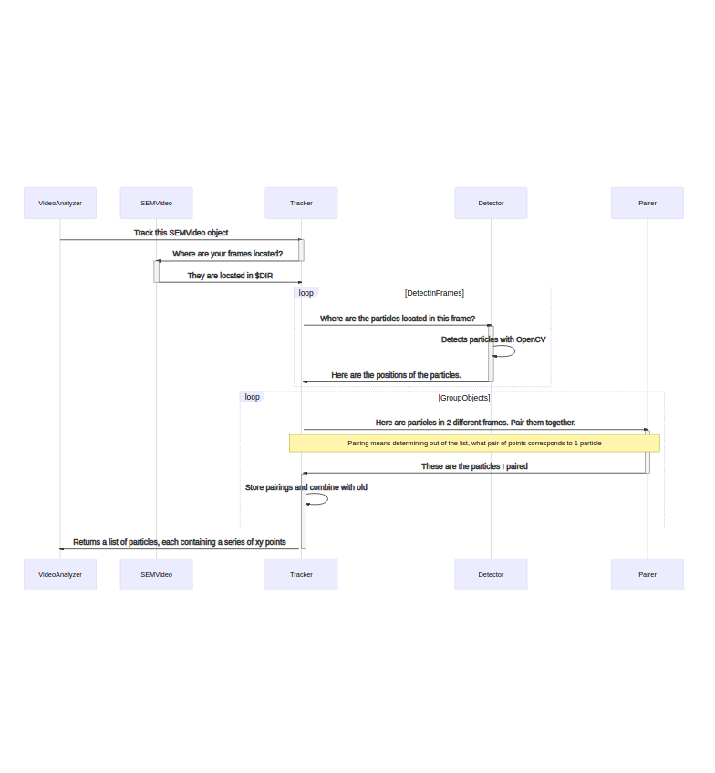

# USRA_Video

## Table of Contents

1. [Introduction](#introduction)
2. [Installation](#installation)
    1. [Dependencies](#subinstallation)
3. [Usage](#usage)
4. [Example](#example)
    1. [Before](#subexample)
    2. [After](#sub2example)
5. [Logic](#logic)
    1. [Enhancement](#sublogic)
    2. [Tracking](#sub2logic)
6. [License](#license)

## Introduction <a name="introduction"></a>

This is a work in progress gem written during undergraduate research
with Cleveland State University's physics department. The goal of the
gem is to assist with quickly analyzing electron microscope videos of
microgels suspended in ionic liquid. This is accomplished in several
steps.

1. Convert the image to black and white, where the microgels are white and the background is black. The header is not adjusted.
2. Perform object detection of microgel particles using OpenCV and a Haar Cascade model.
3. Look between adjacent frames, trying to group microgel positions together. This would track the position of microgels for the entire video.
4. Use the positional data that was just gathered to automatically analyze the microgels.

## Installation <a name="installation"></a>

Add this line to your application's Gemfile:

```ruby
gem 'usra_video'
```

And then execute:

    $ bundle install

Or install it yourself as:

    $ gem install usra_video

### Dependencies <a name="subinstallation"></a>

Be sure that ImageMagick and OpenCV 2.4.13.7 are installed on the
system. Other versions of OpenCV < 3.0 may work, but are untested.
This is a limitation of the ruby-opencv gem dependency. Depending on
where OpenCV is installed, the ruby-opencv gem may need to be pointed
at the location during installation.

## Usage <a name="usage"></a>

This gem comes with an executable called usra_video. You can run the application with

     $ usra_video FILE

where FILE is the video you want to analyze.

## Example <a name="example"></a>

This is an example showing the effectiveness of the contrast
enhancement and particle tracking for silica particles in ionic
liquid.

### Before <a name="subexample"></a>



### After <a name="sub2example"></a>



## Logic <a name="logic"></a>

Here are some sequence diagrams that should provide a outline of how
the different classes interact with each other. The diagrams were made
using [Mermaid](https://github.com/mermaid-js/mermaid).

### Enhancement <a name="sublogic"></a>



### Tracking <a name="sub2logic"></a>



## License <a name="license"></a>

The gem is available as open source under the terms of the [MIT License](https://opensource.org/licenses/MIT).